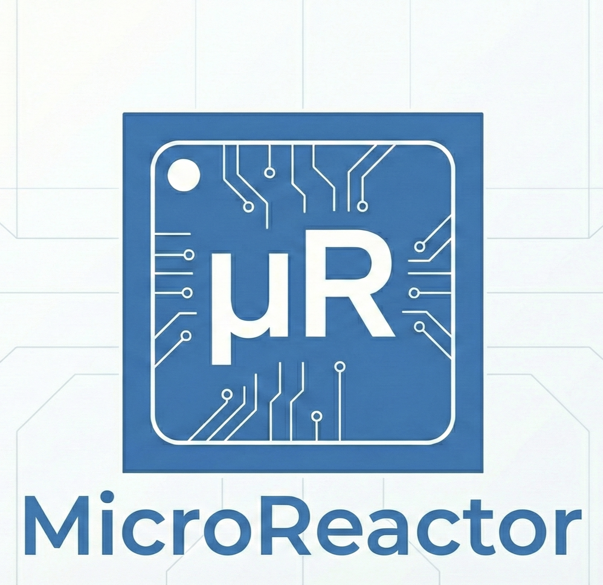

# MicroReactor <small>v3.0</small>

[](LICENSE)
[]()
[]()

<p align="center">
  
</p>

> **为微控制器而生的响应式架构。稳如磐石，灵动如流。**

MicroReactor v3.0 将现代异步编程范式带入嵌入式世界。在资源受限的环境下，为开发者提供最高级别的抽象与开发体验。

---

## 📖 简介

MicroReactor 并不是另一个普通的 RTOS，而是一个构建在裸机或 RTOS 之上的**响应式框架**。它旨在解决嵌入式开发中常见的痛点：回调地狱、状态管理混乱以及跨芯片通信的复杂性。

通过引入 **Actor 模型**、**有限状态机 (FSM)** 和 **无栈协程 (uFlow)**，MicroReactor 让您能够以同步的思维编写异步代码，同时保持系统的硬实时特性。

---

## ✨ 核心亮点

### 🛡️ 零动态分配 (Zero Alloc)
**把崩溃扼杀在编译期。**
所有数据结构（实体、信号、队列）均在静态区分配。彻底消除 `malloc/free` 带来的内存碎片风险，确保工业级设备 7x24 小时的长期运行稳定性。

### ⚡️ FSM + uFlow 混合引擎
**状态机的严谨 + 协程的直观。**
框架完美融合了两种强大的控制流模式：
- **FSM（状态机）**：负责管理复杂的设备生命周期（如：`初始化` -> `连接中` -> `就绪` -> `错误`）。
- **uFlow（无栈协程）**：负责处理线性的业务流程（如：`开灯` -> `等2秒` -> `关灯`），无需将逻辑拆分到多个回调函数中。

### 🔌 中间件管道 (Pipeline)
**面向切面编程 (AOP) 的嵌入式实现。**
在信号到达实体处理函数之前，通过管道对其进行预处理。您可以轻松插入拦截器、日志记录器、防抖逻辑或数据转换器，从而保持核心业务代码的纯净无暇。

### 🌀 虫洞 (Wormhole)
**位置透明的分布式通信。**
打破芯片的物理边界。您在 A 芯片上发出的信号，可以通过 UART/SPI 自动传输并触发 B 芯片上的实体。框架自动处理序列化与路由，无需手写解析协议，多芯片协作从未如此简单。

### 🩺 监督者 (Supervisor)
**借鉴 Erlang 的容错哲学。**
构建具备自愈能力的系统。当传感器或子模块发生致命错误时，监督者实体会自动捕获异常并按策略重置故障模块，而不是让整个 MCU 复位。

## 快速开始

### 添加为 ESP-IDF 组件

将 `components/micro_reactor` 文件夹复制到项目的 `components` 目录。

### 基本使用

```c
#include "ur_core.h"
#include "ur_flow.h"

/* 定义信号 */
enum {
    SIG_BUTTON = SIG_USER_BASE,
    SIG_TIMEOUT,
};

/* 定义状态 */
enum {
    STATE_OFF = 1,
    STATE_ON,
};

/* 定义动作函数 */
static uint16_t turn_on(ur_entity_t *ent, const ur_signal_t *sig) {
    gpio_set_level(LED_PIN, 1);
    return 0;  /* 保持当前状态 */
}

static uint16_t turn_off(ur_entity_t *ent, const ur_signal_t *sig) {
    gpio_set_level(LED_PIN, 0);
    return 0;
}

/* 定义状态规则 */
static const ur_rule_t off_rules[] = {
    UR_RULE(SIG_BUTTON, STATE_ON, turn_on),
    UR_RULE_END
};

static const ur_rule_t on_rules[] = {
    UR_RULE(SIG_BUTTON, STATE_OFF, turn_off),
    UR_RULE_END
};

static const ur_state_def_t led_states[] = {
    UR_STATE(STATE_OFF, 0, NULL, NULL, off_rules),
    UR_STATE(STATE_ON, 0, NULL, NULL, on_rules),
};

/* 创建并运行实体 */
static ur_entity_t led;

void app_main(void) {
    ur_entity_config_t cfg = {
        .id = 1,
        .name = "LED",
        .states = led_states,
        .state_count = 2,
        .initial_state = STATE_OFF,
    };

    ur_init(&led, &cfg);
    ur_start(&led);

    while (1) {
        ur_dispatch(&led, portMAX_DELAY);
    }
}
```

## 核心概念

### 实体（Entity）

实体是核心的响应式单元，每个实体包含：
- 唯一 ID
- 状态机（包含状态和转换规则）
- 信号收件箱队列
- 可选的混入（Mixin）和中间件
- 用于 uFlow 协程的暂存区（Scratchpad）

### 信号（Signal）

信号是轻量级消息，共 20 字节：
- 16 位信号 ID
- 16 位源实体 ID
- 4 字节内联载荷（u8/u16/u32/float 联合体）
- 指向外部数据的指针
- 时间戳

```c
/* 创建信号 */
ur_signal_t sig = ur_signal_create(SIG_TEMP, entity_id);
sig.payload.u32[0] = temperature;

/* 发送到实体 */
ur_emit(&target_entity, sig);

/* 从中断发送 */
ur_emit_from_isr(&target_entity, sig, &woken);
```

### 状态机

状态通过转换规则定义行为：

```c
/* 规则：收到 SIG_X 信号时，转换到 STATE_Y 并执行 action_fn */
UR_RULE(SIG_X, STATE_Y, action_fn)

/* 动作函数签名 */
uint16_t action_fn(ur_entity_t *ent, const ur_signal_t *sig) {
    /* 处理信号 */
    /* 返回值：0 = 使用规则的 next_state，非零 = 覆盖目标状态 */
    return 0;
}
```

### 层级状态机（HSM）

状态可以有父状态，实现信号冒泡：

```c
static const ur_state_def_t states[] = {
    UR_STATE(STATE_PARENT, 0, entry_fn, exit_fn, parent_rules),
    UR_STATE(STATE_CHILD, STATE_PARENT, NULL, NULL, child_rules),
};
```

信号查找顺序：
1. 当前状态规则
2. 混入（Mixin）规则
3. 父状态规则（HSM 冒泡）

### uFlow 协程

使用 Duff's Device 实现的无栈协程：

```c
uint16_t blink_action(ur_entity_t *ent, const ur_signal_t *sig) {
    UR_FLOW_BEGIN(ent);

    while (1) {
        led_on();
        UR_AWAIT_TIME(ent, 500);  /* 等待 500ms */

        led_off();
        UR_AWAIT_SIGNAL(ent, SIG_TICK);  /* 等待信号 */
    }

    UR_FLOW_END(ent);
}
```

跨 yield 变量必须使用暂存区：

```c
typedef struct {
    int counter;
    float value;
} my_scratch_t;

UR_SCRATCH_STATIC_ASSERT(my_scratch_t);

/* 在动作函数中 */
my_scratch_t *s = UR_SCRATCH_PTR(ent, my_scratch_t);
s->counter++;
```

### 中间件（转换器）

中间件在状态规则之前处理信号：

```c
/* 中间件函数 */
ur_mw_result_t my_middleware(ur_entity_t *ent, ur_signal_t *sig, void *ctx) {
    if (should_filter(sig)) {
        return UR_MW_FILTERED;  /* 丢弃信号 */
    }
    return UR_MW_CONTINUE;  /* 传递给下一个 */
}

/* 注册 */
ur_register_middleware(&entity, my_middleware, context, priority);
```

内置中间件：
- `ur_mw_logger` - 信号日志
- `ur_mw_debounce` - 防抖过滤
- `ur_mw_throttle` - 速率限制
- `ur_mw_filter` - 自定义谓词过滤

### 混入（Mixin）

与状态无关的信号处理器：

```c
static const ur_rule_t power_rules[] = {
    UR_RULE(SIG_POWER_OFF, 0, handle_power_off),
    UR_RULE_END
};

static const ur_mixin_t power_mixin = {
    .name = "Power",
    .rules = power_rules,
    .rule_count = 1,
    .priority = 10,
};

ur_bind_mixin(&entity, &power_mixin);
```

### 数据管道

高吞吐量数据流：

```c
/* 静态缓冲区 */
static uint8_t buffer[1024];
static ur_pipe_t pipe;

/* 初始化 */
ur_pipe_init(&pipe, buffer, sizeof(buffer), 64);

/* 写入（任务上下文） */
ur_pipe_write(&pipe, data, size, timeout_ms);

/* 写入（中断上下文） */
ur_pipe_write_from_isr(&pipe, data, size, &woken);

/* 读取 */
size_t read = ur_pipe_read(&pipe, buffer, size, timeout_ms);

/* 状态查询 */
size_t available = ur_pipe_available(&pipe);
size_t space = ur_pipe_space(&pipe);
```

### 虫洞（跨芯片 RPC）

通过 UART 进行分布式信号路由：

```c
/* 初始化 */
ur_wormhole_init(chip_id);

/* 添加路由：本地实体 1 <-> 远程实体 100 */
ur_wormhole_add_route(1, 100, UART_NUM_1);

/* 发送到远程 */
ur_wormhole_send(100, signal);
```

协议帧格式（10 字节）：
```
| 0xAA | SrcID (2B) | SigID (2B) | Payload (4B) | CRC8 |
```

### 监督者（自愈机制）

自动重启失败的实体：

```c
/* 创建监督者 */
ur_supervisor_create(&supervisor_entity, max_restarts);

/* 添加子实体 */
ur_supervisor_add_child(&supervisor_entity, &child1);
ur_supervisor_add_child(&supervisor_entity, &child2);

/* 报告故障（触发重启） */
ur_report_dying(&child1, error_code);
```

## 配置

通过 `menuconfig` 或 `sdkconfig` 配置：

```
CONFIG_UR_MAX_ENTITIES=16           # 最大实体数
CONFIG_UR_MAX_RULES_PER_STATE=16    # 每状态最大规则数
CONFIG_UR_MAX_STATES_PER_ENTITY=16  # 每实体最大状态数
CONFIG_UR_MAX_MIXINS_PER_ENTITY=4   # 每实体最大混入数
CONFIG_UR_INBOX_SIZE=8              # 收件箱队列大小
CONFIG_UR_SCRATCHPAD_SIZE=64        # 协程暂存区大小
CONFIG_UR_MAX_MIDDLEWARE=8          # 最大中间件数
CONFIG_UR_ENABLE_HSM=y              # 启用层级状态机
CONFIG_UR_ENABLE_LOGGING=n          # 启用调试日志
CONFIG_UR_ENABLE_TIMESTAMPS=y       # 启用时间戳
```

## 示例

### example_basic

LED 闪烁器与按钮控制：
- 实体初始化
- 信号发送
- FSM 状态转换
- uFlow 协程定时

### example_multi_entity

温度监控系统：
- 中间件链（日志、防抖）
- 混入用法（通用电源规则）
- 实体间通信

### example_pipe

音频风格的数据流：
- 生产者-消费者模式
- 中断安全写入
- 吞吐量监控

## API 参考

### 核心函数

```c
ur_err_t ur_init(ur_entity_t *ent, const ur_entity_config_t *config);
ur_err_t ur_start(ur_entity_t *ent);
ur_err_t ur_stop(ur_entity_t *ent);
ur_err_t ur_emit(ur_entity_t *target, ur_signal_t sig);
ur_err_t ur_emit_from_isr(ur_entity_t *target, ur_signal_t sig, BaseType_t *woken);
ur_err_t ur_dispatch(ur_entity_t *ent, uint32_t timeout_ms);
int ur_dispatch_all(ur_entity_t *ent);
```

### 状态管理

```c
uint16_t ur_get_state(const ur_entity_t *ent);
ur_err_t ur_set_state(ur_entity_t *ent, uint16_t state_id);
bool ur_in_state(const ur_entity_t *ent, uint16_t state_id);
```

### 混入/中间件

```c
ur_err_t ur_bind_mixin(ur_entity_t *ent, const ur_mixin_t *mixin);
ur_err_t ur_register_middleware(ur_entity_t *ent, ur_middleware_fn_t fn, void *ctx, uint8_t priority);
```

### 管道函数

```c
ur_err_t ur_pipe_init(ur_pipe_t *pipe, uint8_t *buffer, size_t size, size_t trigger);
size_t ur_pipe_write(ur_pipe_t *pipe, const void *data, size_t size, uint32_t timeout_ms);
size_t ur_pipe_read(ur_pipe_t *pipe, void *buffer, size_t size, uint32_t timeout_ms);
size_t ur_pipe_available(const ur_pipe_t *pipe);
```

## 错误码

| 错误码 | 描述 |
|--------|------|
| `UR_OK` | 成功 |
| `UR_ERR_INVALID_ARG` | 无效参数 |
| `UR_ERR_NO_MEMORY` | 静态池已满 |
| `UR_ERR_QUEUE_FULL` | 收件箱已满 |
| `UR_ERR_NOT_FOUND` | 实体/状态未找到 |
| `UR_ERR_INVALID_STATE` | 无效状态转换 |
| `UR_ERR_TIMEOUT` | 操作超时 |

## 目标平台

- **ESP-IDF 5.x**（FreeRTOS v10.5+）
- 使用现代 FreeRTOS API：
  - `xPortInIsrContext()` 用于中断检测
  - `xStreamBufferCreateStatic()` 用于管道
  - `xQueueCreateStatic()` 用于收件箱

## 许可证

GPL v3 许可证

## 文档

- [详细教程（中文）](docs/tutorial_zh.md)
- [API参考（中文）](docs/api_reference_zh.md)
